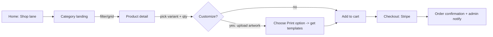
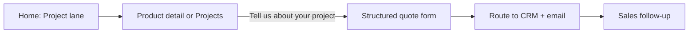
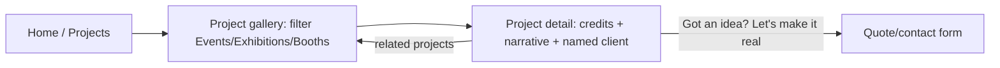
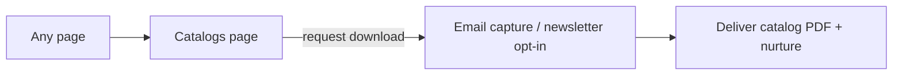

# Picpong — User Flows (Phase 3, fast-track)

> Four core flows from `redesign-plan.md` §5.4, adapted to cartonlab's dual-funnel model + our real commerce.
> **Last updated:** 2026-05-31

## (a) Buy a stock product

## (b) Request quote for custom job

## (c) Browse case study → enquiry

## (d) Download catalog → email capture

**Shared closing CTA** (cartonlab style): one consistent line — e.g. *"Got an idea? Let's make it real."* — on PDPs, projects, and footer.
