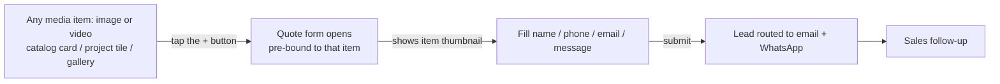
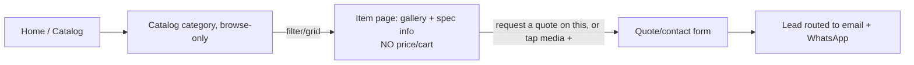
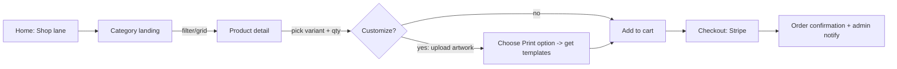

# Picpong — User Flows (Phase 3, fast-track)

> Core flows from `redesign-plan.md` §5.4.
> ⚠️ **AMENDED 2026-06-03 (concept review):** commerce is **Phase 2**, so the "buy a stock product" / checkout flow is replaced by **lead-gen quote flows**. The headline flow is the **per-media "+" → quote-with-thumbnail**; reps **deep-link** prospects to a specific project page. Source: `docs/human-review/meeting1-analysis.md` (FR-12–19); embodied in `docs/prd/01-foundation-structure.md`.
> **Last updated:** 2026-06-09

## (a) Per-media quote request (headline flow)

A visitor sees something they like and asks for a quote on *that exact item* in one click — *"one click כזה של אהבתי את זה, תחזרו אליי."*



## (b) Sales-rep deep-link → quote

An internal rep sends a prospect straight to a specific project (or item) page; the prospect requests a quote from there.

```mermaid
flowchart LR
  Rep[Sales rep] -->|share deep link| D[Specific project page<br/>H1 + H2 + image(s)]
  D -->|tap + on a media item or page quote CTA| Q[Quote form, pre-bound to that project/item]
  Q -->|submit| L[Lead routed to email + WhatsApp]
  L --> R[Sales follow-up]
```

## (c) Browse catalog → quote



## (d) Browse project → contact

```mermaid
flowchart LR
  H[Home / Projects] --> G[Projects index: searchable, variable-size collage]
  G -->|search / filter| D[Project page: H1 + H2 + image(s)]
  D -->|More work link| G
  D -->|"Got an idea? Let's make it real"| Q[Quote/contact form]
```

<!-- (e) "Download catalog → email capture" dropped 2026-07-05 (owner decision):
     no PDF-catalog download surface in scope; /catalogs/ removed from sitemap.
     Reinstate here + add a PRD if a catalog lead-magnet is ever wanted. -->

**Shared closing CTA** (cartonlab style): one consistent line — e.g. *"Got an idea? Let's make it real."* — on item pages, projects, and footer. A **floating contact form** is also present on every page.

---

## Phase 2 (deferred) — buy a stock product

> ⚠️ Not in this build. Commerce (cart/checkout/payment) moves to Phase 2 (2026-06-03 concept review). Retained for the future shop:


